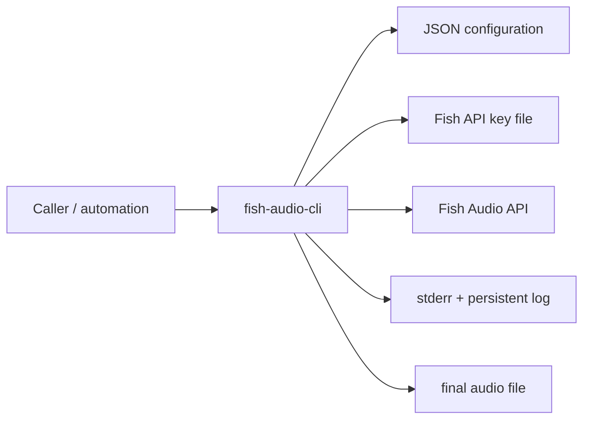
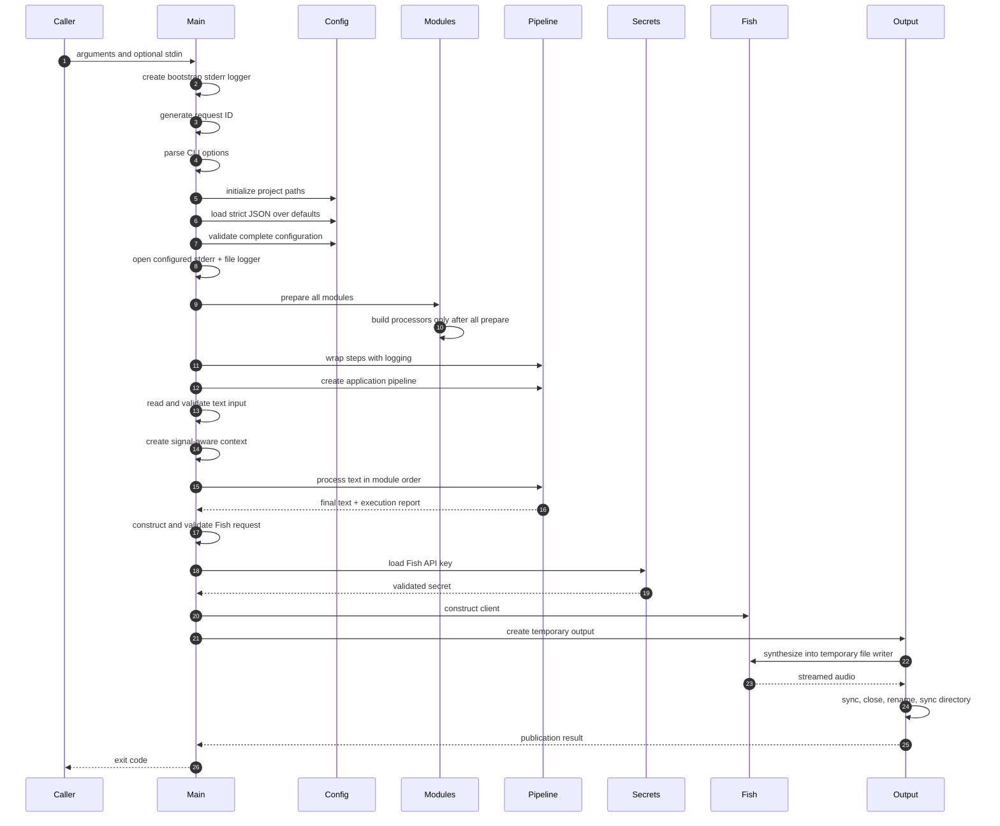

# Architecture

> **Document status:** normative description of the current pre-release core architecture. A disagreement between this document and the implementation is treated as a documentation or implementation defect, not as an invitation to guess.
>
> **Audience:** maintainers, reviewers, module authors, and operators who need to understand how `fish-audio-cli` behaves beyond the quick-start examples.
>
> **Scope:** this document describes the current core architecture and its runtime guarantees. Configuration field details belong in [`configuration.md`](configuration.md).

---

## 1. Overview

`fish-audio-cli` is a single-run command-line application that converts one text input into one audio file.

Its complete processing path is:

```text
command-line arguments
        │
        ▼
path initialization
        │
        ▼
strict configuration loading and validation
        │
        ▼
logging initialization
        │
        ▼
module preparation and processor construction
        │
        ▼
text input from --text or stdin
        │
        ▼
ordered text-processing pipeline
        │
        ▼
Fish Audio request construction
        │
        ▼
late API-key loading and Fish client construction
        │
        ▼
streaming synthesis into a temporary file
        │
        ▼
atomic publication of the final audio file
```

The program is intentionally small in scope:

- it is not a daemon;
- it does not expose an HTTP service;
- it does not maintain shared runtime state between invocations;
- it does not treat Fish synthesis as a pipeline module;
- it does not allow modules to return arbitrary data types;
- it does not create a general-purpose workflow engine.

The core architectural contract is deliberately narrow:

> A configured sequence of independent text modules receives valid text in array order and produces valid text that is sent to Fish Audio.

Everything outside that text-to-text contract remains a core application responsibility.

---

## 2. Design goals

The architecture prioritizes the following properties.

### 2.1 Predictability

One invocation performs one bounded sequence of operations and exits with a stage-specific status code.

There are no background workers, hidden queues, persistent sessions, or cross-process caches.

### 2.2 Explicit boundaries

Each package owns a distinct responsibility:

- CLI parsing does not load configuration;
- configuration loading does not initialize modules;
- modules do not synthesize audio;
- the pipeline does not know module-specific configuration;
- the Fish client does not decide output file semantics;
- output publication does not know anything about Fish Audio.

### 2.3 Failure containment

A module cannot permanently corrupt the pipeline text merely by returning an error or producing invalid output.

The pipeline restores a known-valid text value before applying the configured failure policy.

### 2.4 Late acquisition of sensitive data

The Fish API key is loaded only after:

- arguments are valid;
- configuration is valid;
- logging is initialized;
- modules are initialized;
- input is valid;
- text processing has completed;
- the Fish request itself has been constructed and validated.

This minimizes the lifetime of the secret in application memory and avoids touching the secret file for invocations that cannot reach synthesis.

### 2.5 Durable output publication

Fish audio is never streamed directly into the final destination path.

The application writes to a unique temporary file beside the destination, synchronizes and closes it, atomically replaces the destination, then synchronizes the containing directory.

### 2.6 Extensibility without core coupling

New text-processing behavior is added by registering a module type that implements the shared preparation and processing contracts.

The core does not gain module-specific fields, branches, or provider logic.

---

## 3. System context



The application has five primary external boundaries:

1. command-line arguments and standard input;
2. the JSON configuration file;
3. the Fish API key file;
4. the Fish Audio HTTP API;
5. the local filesystem used for logs and audio output.

Each boundary is validated independently and reports contextual errors.

---

## 4. Package responsibilities

| Package | Responsibility | Explicitly does not own |
|---|---|---|
| `cmd/fish-audio-cli` | Process orchestration, signal handling, stage logging, exit-code mapping | Module algorithms, Fish protocol internals, atomic write mechanics |
| `internal/cli` | Option parsing, usage text, bounded text input | Configuration loading, path resolution |
| `internal/projectpath` | Absolute config path and project-relative path resolution | Filesystem creation, configuration semantics |
| `internal/config` | Defaults, strict JSON loading, null checks, semantic validation, typed conversions | Module-specific config decoding, secret contents |
| `internal/logging` | Logger construction, stderr/file fan-out, formats, levels, file permissions | Application-stage policy |
| `internal/modules` | Module type registry, two-phase preparation/build, conversion to pipeline steps | Pipeline execution, module algorithms |
| `internal/moduleconfig` | Strict decoding helper for one module-owned config object | Module-specific semantic validation |
| `internal/modules/<type>` | One module implementation and its private configuration | Global pipeline policy, Fish synthesis |
| `internal/pipeline` | Ordered execution, rollback, failure policies, reports, module logging decorator | Config files, registry, Fish Audio |
| `internal/app` | Application-facing text-processing boundary and Fish request assembly | CLI, secret loading, output paths |
| `internal/fish` | Fish endpoint validation, request validation, HTTP synthesis, retries, API error classification | Secret-file lifecycle, final-file publication |
| `internal/secrets` | Secure secret-file creation/opening, permission checks, bounded single-line parsing | API-client construction |
| `internal/output` | Temporary-file lifecycle and atomic destination replacement | Audio format or provider semantics |
| `internal/boundedio` | Size-limited reader consumption | Text or secret semantics |
| `internal/strictjson` | Exact JSON validation and decoding | Business rules |
| `internal/textcontract` | Shared valid-text invariant | Module behavior |
| `internal/nilvalue` | Detection of ordinary and typed nil interface values | Domain validation |

The boundaries are intentionally layered. Similar checks at different public boundaries are not automatically redundant: each package protects its own contract so it can be safely tested and reused independently.

---

## 5. Runtime sequence

The runtime sequence in `cmd/fish-audio-cli` is deliberately ordered.



### 5.1 Bootstrap logging

The program first creates a text logger that writes only to standard error.

This logger exists before the configuration file is available, allowing failures in:

- request ID generation;
- argument parsing;
- path initialization;
- configuration loading;
- configuration validation;
- configured logger initialization

to be reported consistently.

After configuration validation, the program opens the configured persistent log file and creates the normal logger that writes to both standard error and the file.

Both loggers share the same request ID.

### 5.2 Request ID

Each invocation receives a cryptographically random request ID.

The ID is attached to structured log records so messages from concurrent independent processes can be correlated without introducing shared process state.

### 5.3 Argument parsing before filesystem work

CLI options are parsed before project paths or configuration files are accessed.

Help exits successfully without requiring a valid configuration, API key, or output destination.

Invalid arguments fail before module or network initialization.

### 5.4 Configuration before module initialization

The configuration file is:

1. opened from the absolute resolved config path;
2. read with a fixed maximum byte count;
3. closed with read and close errors preserved;
4. decoded over built-in defaults;
5. validated as strict UTF-8 JSON;
6. checked for duplicate object keys;
7. checked for exact field-name casing;
8. checked for unknown fields;
9. checked for unsupported `null` values at configuration boundaries that require concrete objects, arrays, strings, or numbers;
10. semantically validated.

Module-specific `config` objects remain opaque to the top-level configuration package. They are validated structurally as JSON objects, then dispatched to their selected module type.

---

## 6. Project-relative paths

`projectpath.Resolver` establishes a stable path base from the selected configuration file.

### 6.1 Config path

The configured path is converted to an absolute, cleaned path.

### 6.2 Project directory

If the configuration file is directly inside a directory named `config`, the project directory is the parent of that `config` directory.

Example:

```text
/srv/fish-audio-cli/config/config.json
```

produces:

```text
project directory: /srv/fish-audio-cli
```

For a configuration file elsewhere, its containing directory becomes the project directory.

Example:

```text
/etc/fish-audio-cli.json
```

produces:

```text
project directory: /etc
```

### 6.3 Relative and absolute paths

Configured relative paths passed through the resolver are resolved from the project directory.

Absolute paths are cleaned but not rebased.

This rule is used for the Fish API key path and persistent log path. The output path is supplied by the caller through the CLI and is passed to the output layer without project-root rebasing.

---

## 7. Configuration model

Top-level configuration is typed and defaulted.

The decoder starts with `config.Default()` and applies fields from the JSON file over those values. During loading, the Fish API key path is resolved immediately through the project resolver; the persistent log path is resolved later by the logging package when the configured logger is opened.

This permits concise local configuration while retaining a complete in-memory configuration after loading.

Strict decoding is intentional:

- misspelled fields fail;
- incorrectly capitalized JSON field names fail;
- duplicate object keys fail;
- multiple top-level JSON values fail;
- invalid UTF-8 fails;
- unknown fields fail.

Module-specific configuration uses the same strict decoder through `moduleconfig.Decode`.

Semantic rules remain in the package that owns the value:

- top-level ranges and enums are validated by `internal/config`;
- Fish request parameters are validated by `internal/fish`;
- module-specific fields are validated by the module implementation.

---

## 8. Module architecture

### 8.1 Module type versus module instance

A **module type** is a registered implementation, such as `passthrough`.

A **module instance** is one configured entry in `pipeline.modules`.

Several instances may use the same type:

```json
{
  "pipeline": {
    "onError": "use_previous",
    "modules": [
      {
        "name": "first-pass",
        "type": "passthrough",
        "config": {}
      },
      {
        "name": "second-pass",
        "type": "passthrough",
        "onError": "abort",
        "config": {}
      }
    ]
  }
}
```

The instances are independent because each entry has its own:

- unique name;
- module-owned config;
- optional error-policy override;
- preparation result;
- processor builder;
- processor object.

There is no implicit module configuration inheritance or global module configuration pool.

### 8.2 Registry boundary

The module registry maps a configured type string to a preparation function.

The registry does not decode module-specific fields itself. It passes three pieces of information:

- the project path resolver;
- the module’s raw JSON config object;
- the expectation that the preparer returns an instance-specific processor builder.

Adding a module requires a registry entry, but does not require changing pipeline execution.

### 8.3 Two-phase initialization

Module initialization has two distinct phases.

#### Prepare phase

Every configured module instance is prepared in array order.

Preparation may:

- strictly decode the module-owned config;
- perform semantic validation;
- resolve configured paths;
- create immutable in-memory values;
- return an instance-specific builder.

Preparation must not acquire mandatory-close runtime resources.

If any module fails preparation:

- no processor builder is invoked;
- no pipeline is created;
- the invocation exits before input processing or secret loading.

#### Build phase

Only after every instance prepares successfully are builders invoked in array order.

Each builder returns one processor.

If a builder fails or returns a nil processor:

- pipeline construction stops;
- the application does not read input or load the Fish API key.

### 8.4 Current processor lifecycle

The current processor interface has one method:

```go
Process(ctx context.Context, document *pipeline.Document) error
```

There is no processor `Close` method and no application shutdown lifecycle for processors.

Therefore, a module processor must not own resources whose correctness depends on an explicit cleanup call.

Acceptable processor state includes:

- immutable configuration;
- compiled regular expressions;
- reusable in-memory lookup tables;
- clients that do not require explicit shutdown;
- ordinary counters or instance-local synchronization primitives.

A future requirement for mandatory cleanup must be designed across the complete lifecycle, including partial build failure and reverse-order shutdown. It should not be introduced as an undocumented optional interface.

---

## 9. Pipeline document and text contract

### 9.1 Document

The pipeline uses a `Document` containing:

- immutable original text;
- mutable current text.

The original value is stored in an unexported field and exposed only through `OriginalText()`.

Modules may change the current `Text` field. They cannot directly replace the stored original value.

### 9.2 Valid text

Text is valid when it:

- is valid UTF-8;
- contains at least one non-whitespace rune.

The same contract is enforced for:

- CLI text input;
- new pipeline documents;
- successful module output;
- Fish synthesis request text.

### 9.3 Ordered execution

Pipeline steps execute strictly in configured array order.

The current text after a successful step becomes the input to the next step.

An empty module array is valid and returns the original input unchanged.

---

## 10. Pipeline failure and rollback

Before invoking a processor, the pipeline saves the current text as `previousText`.

If the processor:

- returns an error; or
- returns successfully but leaves invalid text

the pipeline restores `previousText` before applying the configured failure policy.

This ensures a failed processor cannot leak partial mutation into later steps.

### 10.1 `use_previous`

```text
restore text from before the failed module
continue with the next module
record recovered outcome
```

### 10.2 `use_original`

```text
restore original pipeline input
continue with the next module
record recovered outcome
```

### 10.3 `skip`

```text
restore text from before the failed module
stop remaining modules
return pipeline success with stopped outcome
continue to Fish synthesis
```

`skip` means “stop the pipeline,” not “ignore only this module.”

### 10.4 `abort`

```text
restore text from before the failed module
stop remaining modules
return an error
do not start Fish synthesis
```

### 10.5 Invalid module output

A processor that returns `nil` but leaves empty, whitespace-only, or invalid UTF-8 text is treated exactly like a processor failure.

The configured policy is applied after rollback.

---

## 11. Cancellation and interruption

The CLI creates a context canceled by:

- `SIGINT`;
- `SIGTERM`.

The same context is passed to:

- every processor;
- the Fish HTTP request;
- retry waits.

Cancellation and deadline expiration override module fallback policies.

If interruption occurs during a processor call:

- the module’s mutation is rolled back;
- the step is recorded as interrupted;
- remaining modules do not run;
- Fish synthesis does not start.

If interruption occurs after a processor returns but before the pipeline accepts the step result:

- the step mutation is also rolled back;
- the pipeline returns an interruption error.

If interruption occurs while waiting to retry Fish Audio:

- the last API error is preserved;
- the context error is joined with it.

---

## 12. Pipeline reporting

Each pipeline execution returns a `Report`, including partial executions that ended in failure or interruption after argument validation.

The report records:

- final pipeline outcome;
- number of configured steps;
- input character count;
- retained output character count;
- total wall-clock duration;
- one `StepResult` for every step that started.

Each step result records:

- configured instance name;
- module type;
- effective error policy;
- outcome;
- input and retained output character counts;
- duration;
- the error that caused recovery, stopping, failure, or interruption.

Character counts use Unicode code points, not bytes.

Reports are operational metadata. They do not contain the processed text itself.

---

## 13. Module logging decorator

Module logging is added after processors are built and before the application pipeline is constructed.

`pipeline.WithLogging` decorates each processor without changing its configured identity or error policy.

The decorator logs:

- module start;
- module completion;
- module failure;
- module interruption;
- input and output character counts;
- duration;
- module name and type.

The decorator also validates successful module output before reporting completion.

The pipeline independently validates output as part of its own execution contract. This apparent duplication protects two distinct boundaries:

- the decorator ensures its success log is truthful;
- the pipeline remains correct even when used without the decorator.

---

## 14. Application boundary

`internal/app` provides the application-facing text API.

It converts a raw input string into a validated pipeline document, executes the pipeline, and returns:

- final processed text;
- complete pipeline report.

This keeps `pipeline` focused on document execution while allowing callers to use a simple string-based boundary.

The same package also constructs a Fish synthesis request from:

- validated Fish configuration;
- processed text;
- CLI-selected format.

The request is validated before the secret file is touched or the Fish client is created.

---

## 15. Fish request and client lifecycle

### 15.1 Request construction

Fish request construction copies configuration-owned mutable values so the request is an independent snapshot.

The request includes:

- processed text;
- optional reference ID;
- selected format;
- synthesis parameters.

Validation checks text, format, numeric ranges, finite floating-point values, and format-specific sample-rate compatibility.

### 15.2 Late secret loading

The Fish API key is not loaded during configuration parsing.

It is loaded immediately before Fish client construction.

After the client retains the key, the temporary local variable is overwritten with an empty string. Go strings cannot be reliably zeroized, so this is lifetime reduction rather than a cryptographic memory-erasure guarantee.

### 15.3 Client construction

The Fish client validates:

- base URL;
- API key;
- model header;
- timeout;
- error-body limit;
- retry settings.

Header values are rejected if they contain invalid UTF-8 or ASCII control characters.

The base URL may contain a base path. The client appends `v1/tts`. User information, query parameters, fragments, missing hosts, and unsupported schemes are rejected.

---

## 16. HTTP synthesis and retries

The request body is encoded once before the retry loop.

Each attempt creates a new HTTP request with the invocation context and a new reader over the encoded body.

The client sets:

- bearer authorization;
- JSON content type;
- Fish model header.

### 16.1 Successful response

For a successful HTTP status, the response body is streamed directly into the writer supplied by the output layer.

The client does not buffer the complete audio response in memory.

An empty successful response is rejected.

### 16.2 Error response

For a non-success status:

- the body is read with a configured maximum byte count;
- a typed `APIError` is returned;
- known status codes expose stable categories through `errors.Is`.

### 16.3 Retryable failures

The current policy retries:

- HTTP `429`;
- HTTP `5xx` only when server-error retry is enabled.

It does not retry:

- authentication failures;
- payment-required failures;
- permission failures;
- not-found failures;
- validation failures;
- generic transport errors.

This conservative transport policy avoids automatically replaying a request when the client cannot prove whether the server began processing it.

### 16.4 Retry delay

If a valid `Retry-After` header is present, it is used when it does not exceed the configured maximum delay.

Otherwise, exponential backoff is used.

Retry waits observe context cancellation.

### 16.5 No retry after audio output

Retries occur only after typed API failures returned before successful audio streaming begins.

A read or write failure while streaming a successful audio response is returned immediately. The client does not start a new synthesis attempt after partial audio may have reached the temporary output writer. Because atomic publication has not yet occurred, that partial temporary file is cleaned up and the final destination is not replaced.

---

## 17. Secret-file security

The secret loader treats the API key file as a security boundary.

### 17.1 Missing file

If the configured file does not exist:

- its parent directory is created when necessary;
- the file is created empty with mode `0600`;
- the invocation returns a typed “file created” error;
- synthesis does not continue until the user populates the file.

### 17.2 Directory checks

The containing directory must:

- be a directory;
- not be writable by group or others.

The loader does not silently weaken an existing directory’s permissions.

### 17.3 Existing file checks

The path must identify a regular file.

The loader opens the file relative to an opened directory root, compares filesystem identity before and after opening, and rejects a path that changed during the operation.

The file mode is set to `0600`.

### 17.4 Content contract

The secret is read with a maximum byte count.

Accepted content is:

```text
one non-empty UTF-8 line
```

One trailing `LF` or `CRLF` is permitted and removed.

Rejected content includes:

- invalid UTF-8;
- empty or whitespace-only values;
- additional lines;
- surrounding spaces or tabs.

The temporary byte buffer is cleared before the loader returns.

---

## 18. Logging architecture

The configured logger always writes to:

- standard error;
- one persistent log file.

Persistent file logging cannot currently be disabled through configuration. The logger always opens a file and applies mode `0640`; special-device paths such as `/dev/null` are not supported.

### 18.1 Persistent log file

The logging package:

- resolves the configured path;
- creates missing parent directories with requested mode `0750`;
- does not rewrite permissions of parent directories that already exist;
- opens the file for append;
- creates new files with mode `0640`;
- tightens existing file permissions to `0640`;
- preserves close errors during failed initialization.

### 18.2 Formats and levels

Supported formats:

- text;
- JSON.

Supported levels:

- debug;
- info;
- warn;
- error.

### 18.3 Sensitive text

Input and processed text are logged only when `logging.logText` is enabled.

Character counts and pipeline metadata are logged regardless of that option.

Modules should not independently bypass this policy by logging full text or secrets.

---

## 19. Atomic output publication

`internal/output.WriteAtomic` separates synthesis success from destination publication.

### 19.1 Temporary file

A unique temporary file is created:

- in the destination directory;
- with a name derived from the destination basename;
- using the operating system’s secure temporary-file creation;
- with mode `0600`.

Writing beside the destination ensures the final rename stays within one filesystem.

### 19.2 Write phase

The Fish client streams audio into the temporary file through an `io.Writer`.

If writing fails:

- the existing destination remains unchanged;
- the temporary file is closed;
- the temporary file is removed;
- cleanup errors are joined with the primary error.

### 19.3 Persistence phase

After synthesis succeeds:

1. the temporary file is synchronized;
2. the temporary file is closed;
3. it is renamed over the destination;
4. the containing directory is synchronized and closed.

The rename replaces the destination path itself. If the destination is a symbolic link, the link is replaced; its target is not followed and overwritten.

### 19.4 Failure before publication

Before rename succeeds:

- an existing destination is preserved;
- unpublished temporary output is removed.

### 19.5 Failure after publication

After rename succeeds, the new output is considered published.

If directory synchronization or closing then fails:

- an error is returned;
- the published output is retained;
- the program does not attempt to restore or remove it.

This distinction avoids deleting data that may already be visible at the requested destination.

### 19.6 Parent directories

The output layer does not create a missing destination directory.

The caller must provide an existing writable parent directory.

---

## 20. Error stages and exit codes

The CLI maps failures by stage.

| Exit code | Meaning |
|---:|---|
| `0` | Synthesis completed, or help was displayed |
| `1` | Bootstrap logging or request ID initialization failed |
| `2` | CLI, paths, configuration, configured logging, modules, application, or text input failed |
| `3` | Text processing, Fish request construction, API-key loading, or Fish client construction failed |
| `4` | Fish synthesis or atomic output publication failed |

The categories are operational, not Go package boundaries. They allow callers to distinguish setup errors, processing errors, and synthesis/output errors without parsing log text.

---

## 21. State and concurrency

Each CLI invocation owns its own:

- configuration value;
- module instances;
- pipeline;
- request ID;
- Fish client;
- temporary output file;
- process context.

There is no mutable global runtime state shared between invocations.

The module registry is a package-level map that the application treats as immutable during normal execution.

Independent concurrent invocations do not share mutable application state. Callers should normally provide distinct output paths. If multiple processes target the same destination, ordinary operating-system rename semantics apply, and the last successful replacement determines the visible file.

---

## 22. Architectural invariants

The following rules are treated as core invariants.

1. Module execution order equals configuration array order.
2. Every configured instance has a unique name.
3. A module owns and validates its own complete config object.
4. The core does not interpret module-specific config fields.
5. All modules prepare before any processor is built.
6. A module receives valid current text.
7. A successful module must leave valid text.
8. A failed or interrupted module cannot retain partial text mutation.
9. Context interruption is never converted into a successful fallback.
10. Fish synthesis begins only after text processing succeeds or stops successfully under `skip`.
11. The API key is loaded only after the Fish request is valid.
12. Audio is not written directly to the final destination.
13. The old destination remains intact until rename succeeds.
14. Published output is not deleted after a post-rename persistence error.
15. Secrets and complete text are not logged by default.
16. Processors currently have no explicit cleanup lifecycle.

A code change that violates one of these invariants is an architectural change and must update tests and documentation deliberately.

---

## 23. Extension points

### 23.1 New text module

A new text transformation normally requires:

- a new package under `internal/modules`;
- a private configuration type;
- a `Prepare` function;
- a processor implementation;
- registry registration;
- unit tests;
- configuration and module documentation.

It should not require changes to:

- pipeline execution;
- Fish request handling;
- secret loading;
- output publication.

### 23.2 Additional Fish configuration

A new Fish request parameter normally requires coordinated changes to:

- config type;
- defaults;
- config validation;
- request conversion;
- Fish request type and validation;
- JSON tests;
- example configuration;
- configuration reference.

### 23.3 New output format

A new format affects more than CLI parsing. It may require updates to:

- CLI accepted values;
- Fish request format validation;
- sample-rate compatibility;
- bitrate relevance;
- usage and configuration docs;
- tests;
- output filename examples.

---

## 24. Non-goals

The current architecture does not attempt to provide:

- a plugin ABI for dynamically loaded third-party binaries;
- module discovery from the filesystem;
- arbitrary directed acyclic graphs;
- parallel module execution;
- automatic module config inheritance;
- a shared global LLM client pool;
- persistent daemon state;
- automatic parent-directory creation for final output;
- transparent replay of ambiguous transport failures;
- mandatory processor cleanup;
- full in-memory secret zeroization;
- transactional rollback after the destination rename has already succeeded.

These omissions are deliberate unless a concrete future requirement justifies expanding the architecture.

---

## 25. Review guidance

When reviewing a change, ask:

### Core changes

- Does this concern belong in the core or inside one module?
- Does it change initialization order?
- Does it load secrets or create clients earlier?
- Does it weaken strict validation?
- Does it make rollback or cancellation ambiguous?
- Does it change destination publication semantics?

### Module changes

- Is configuration fully instance-local?
- Is config decoded strictly?
- Does the module check context?
- Can it leave partial mutation before returning an error?
- Does it log sensitive data?
- Does it acquire a resource that requires explicit cleanup?
- Are two instances of the same type independent?

### Documentation changes

- Is the statement backed by current code?
- Is planned behavior clearly labeled as planned?
- Are defaults, ranges, units, and path rules exact?
- Does terminology distinguish module type, module instance, processor, and step?

---

## 26. Summary

`fish-audio-cli` uses a layered, single-run architecture:

- strict input and configuration boundaries;
- independent module instances;
- two-phase module initialization;
- ordered text-to-text processing with rollback;
- late secret loading;
- conservative Fish HTTP retries;
- streaming audio;
- atomic output publication;
- structured stage reporting.

The design intentionally favors explicit control flow over framework machinery. New behavior should extend the narrow contracts already present rather than merging unrelated responsibilities into the core.
