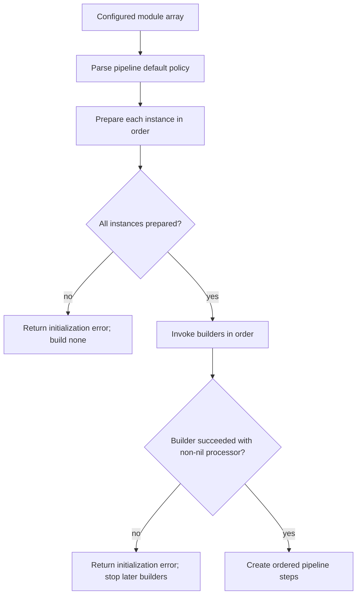

# Module system

> **Document status:** normative description of the current pre-release module system.
>
> **Audience:** users configuring module instances, maintainers reviewing module boundaries, and developers deciding whether new behavior belongs in a module.
>
> **Scope:** this document explains module types, configured instances, module-owned configuration, registry behavior, preparation and construction, runtime responsibilities, lifecycle limitations, security boundaries, and the built-in `passthrough` module. Ordered execution, rollback, error policies, and reports are documented in [`pipeline.md`](pipeline.md). The complete implementation tutorial is in [`module-author-guide.md`](module-author-guide.md).

---

## 1. Purpose

Modules provide local text-processing extensions without coupling their implementation details to the core application.

The module system lets the configuration describe a sequence such as:

```text
input text
    ↓
normalization module
    ↓
pronunciation module
    ↓
emotion-markup module
    ↓
final text
    ↓
Fish Audio
```

The core sees every module through the same narrow contract:

```text
valid current text
    ↓
processor
    ↓
valid updated text or error
```

The core does not need to know:

- how a module transforms text;
- which fields appear in the module’s config;
- whether the module uses rules, dictionaries, regular expressions, or an external text service;
- how many instances of the same module type are configured;
- which instance-specific state the module builds.

This boundary is the main reason modules exist.

New text-processing behavior should normally be implemented as a module instead of adding module-specific branches to:

- `cmd/fish-audio-cli`;
- `internal/app`;
- `internal/pipeline`;
- the Fish client;
- output publication.

---

## 2. What a module is

A module is a compiled-in text-processing implementation registered under a stable type name.

A module implementation consists conceptually of:

```text
private config type
    ↓
Prepare(paths, rawConfig)
    ↓
instance-specific ProcessorBuilder
    ↓
instance-specific Processor
    ↓
Process(ctx, document)
```

The current module system is not a dynamic plugin system.

Modules are:

- Go packages compiled into the executable;
- registered explicitly in the internal module registry;
- selected by configuration through a type string;
- instantiated independently for each configured array item.

Modules are not:

- shared libraries loaded at runtime;
- external executables discovered from a directory;
- scripts evaluated from configuration;
- remote plugins downloaded by the CLI;
- arbitrary graph nodes with typed inputs and outputs.

The word “module” in this project means a built-in, registered text-processing implementation.

---

## 3. Module type and module instance

The distinction between **type** and **instance** is fundamental.

### 3.1 Module type

A module type is one registered implementation.

Example:

```text
passthrough
```

The type determines:

- which preparer is called;
- which private config schema is expected;
- which processor implementation is built;
- which behavior runs at execution time.

### 3.2 Module instance

A module instance is one object in:

```text
pipeline.modules
```

Example:

```json
{
  "name": "first-pass",
  "type": "passthrough",
  "config": {}
}
```

The instance determines:

- its unique operational name;
- the selected module type;
- its complete private config object;
- its optional error-policy override;
- its own preparation result;
- its own processor builder;
- its own processor object.

### 3.3 Repeated types

The same type may appear multiple times.

```json
{
  "pipeline": {
    "onError": "use_previous",
    "modules": [
      {
        "name": "first-pass",
        "type": "passthrough",
        "config": {}
      },
      {
        "name": "second-pass",
        "type": "passthrough",
        "onError": "abort",
        "config": {}
      }
    ]
  }
}
```

These are two independent instances of one implementation.

They are not aliases for one shared processor.

The registry prepares and builds them separately in configured order.

A future configurable type might therefore be used like:

```json
{
  "name": "normalize-before-llm",
  "type": "normalizer",
  "config": {
    "mode": "conservative"
  }
}
```

and later:

```json
{
  "name": "normalize-after-llm",
  "type": "normalizer",
  "config": {
    "mode": "speech"
  }
}
```

No implicit state or config is shared merely because both instances use `normalizer`.

---

## 4. Configured module envelope

Every configured module instance uses the same core envelope:

```json
{
  "name": "unique-instance-name",
  "type": "registered-module-type",
  "onError": "optional-instance-policy",
  "config": {}
}
```

The core owns the envelope fields.

The selected module owns the contents of `config`.

### 4.1 `name`

`name` identifies one configured instance.

It is used in:

- initialization errors;
- pipeline errors;
- structured logs;
- step results.

Requirements:

- non-empty;
- not whitespace-only;
- no leading or trailing whitespace;
- unique across the configured pipeline.

Names are operational identifiers.

They should describe the role of the instance, not merely repeat its type.

Prefer:

```text
normalize-before-emotions
emotion-primary
pronunciation-final
```

over a collection of indistinguishable names such as:

```text
module1
module2
module3
```

### 4.2 `type`

`type` selects a registered implementation.

Requirements:

- non-empty;
- not whitespace-only;
- no leading or trailing whitespace;
- exact match for a registry key.

Type names are not normalized automatically.

The registry does not:

- lowercase values;
- trim them;
- resolve aliases;
- perform fuzzy matching;
- search packages dynamically.

An unsupported type fails module initialization before text input is read.

### 4.3 `onError`

`onError` optionally overrides the pipeline default for this instance.

When omitted:

```text
effective policy = pipeline.onError
```

When present:

```text
effective policy = module instance onError
```

Supported values are:

```text
use_previous
use_original
skip
abort
```

The effective policy is resolved during module preparation and stored in the resulting pipeline step.

The module implementation does not select or apply this policy.

Rollback and fallback remain core pipeline responsibilities.

### 4.4 `config`

`config` is the complete configuration object owned by the selected module instance.

It is required even when the module has no options.

A module with no configurable fields uses:

```json
"config": {}
```

The following are rejected:

```json
"config": null
```

```json
"config": []
```

```json
"config": "value"
```

```json
"config": 123
```

and a missing `config` field.

The core validates that `config` is present and is a JSON object.

The selected module then strictly decodes and semantically validates its contents.

---

## 5. Configuration ownership

Module configuration is instance-local and module-owned.

This rule has several consequences.

### 5.1 Complete inline configuration

Each instance contains its own complete config object.

The module system does not currently provide:

- a global config block per module type;
- named config profiles;
- inheritance from a previous instance;
- merging with package defaults stored elsewhere in JSON;
- references to another instance’s config;
- environment-driven config overlays;
- automatic secret-field expansion.

If a module supports defaults, the module’s preparer must apply those defaults while decoding that instance’s config.

### 5.2 No cross-instance inheritance

Consider:

```json
{
  "name": "first",
  "type": "example",
  "config": {
    "mode": "strict"
  }
}
```

followed by:

```json
{
  "name": "second",
  "type": "example",
  "config": {}
}
```

The second instance does not inherit:

```json
"mode": "strict"
```

from the first.

Its config is decoded from a fresh value.

This prevents state from one array element from leaking into another during JSON decoding.

### 5.3 Opaque to the core

Before dispatch, the core stores module config as:

```go
json.RawMessage
```

The core does not inspect module-specific fields.

It knows only that the value is a JSON object.

This preserves the boundary:

```text
core:
    structure of module envelope

module:
    schema and meaning of config contents
```

### 5.4 Strict decoding

Modules should decode config through:

```go
moduleconfig.Decode(raw, &cfg)
```

This helper requires:

- non-empty data;
- a JSON object;
- a non-nil decode target;
- valid UTF-8 JSON;
- one JSON value;
- no duplicate object keys;
- exact JSON field-name casing;
- no unknown fields for ordinary structs.

A misspelled option should fail initialization instead of being silently ignored.

Example:

```json
{
  "promptTemprature": 0.2
}
```

must not quietly behave as if the user had omitted:

```json
{
  "promptTemperature": 0.2
}
```

### 5.5 Semantic validation

Strict JSON decoding proves structure, not meaning.

The module must still validate rules such as:

- non-empty strings;
- numeric ranges;
- allowed enum values;
- relationships between fields;
- mutually exclusive options;
- required combinations;
- path semantics;
- feature compatibility.

Structural and semantic validation belong in preparation, before any processor is built.

---

## 6. Registry

The module registry maps type names to preparation functions.

Conceptually:

```go
var preparers = map[string]preparer{
    "passthrough": passthrough.Prepare,
}
```

The registry is compiled into the executable.

### 6.1 Registry key

The map key is the public configuration type string.

Changing a registry key is a configuration compatibility change.

Removing or renaming a type causes existing configs to fail with an unsupported-type error.

Stable type names should therefore be:

- concise;
- descriptive;
- lowercase;
- free of instance-specific meaning.

### 6.2 Registry value

The registry value has the internal shape:

```go
type preparer func(
    projectpath.Resolver,
    json.RawMessage,
) (
    pipeline.ProcessorBuilder,
    error,
)
```

Every module type must expose a compatible `Prepare` function.

### 6.3 Unsupported type

If a configured type is absent from the registry:

- initialization stops;
- the error includes instance name, array index, and unsupported type;
- no processor construction begins;
- text input is not read;
- Fish synthesis does not start.

### 6.4 Nil registry entries

The registry rejects a type mapped to a nil preparer.

This is a defensive internal check.

A nil registry entry is a programmer defect, not a recoverable user configuration condition.

### 6.5 Registry mutation

The application treats the package-level registry as immutable during normal execution.

Module types are registered in source code, not added by configuration at runtime.

Runtime registry mutation would introduce:

- data-race risk;
- nondeterministic type availability;
- difficult startup ordering;
- inconsistent documentation;
- unclear security boundaries.

It is outside the current architecture.

---

## 7. Project path resolver

Every preparer receives a `projectpath.Resolver`.

The resolver provides a narrow path capability:

- return the absolute config path;
- resolve a configured path relative to the project directory;
- clean absolute paths without rebasing them.

The core does not give modules unrestricted application objects or the complete top-level config.

### 7.1 Why the resolver is passed

A module may need an instance-specific file such as:

- a pronunciation dictionary;
- a replacement table;
- a prompt template;
- a local rules file;
- a provider-specific secret path.

The resolver lets relative paths follow the same project-root rules as core paths.

### 7.2 What the resolver does not do

The resolver does not:

- open files;
- create directories;
- enforce permissions;
- load secrets;
- decide whether a path is allowed;
- validate module-specific file formats.

Those remain module responsibilities.

### 7.3 Resolve during preparation

Configured module paths should normally be resolved during `Prepare`.

This makes path errors appear before processor construction and text input.

Opening or reading a file may belong in either phase depending on lifecycle and cost:

- lightweight immutable config data can be read and validated during preparation;
- runtime state may be created by the builder;
- mandatory-close resources are not supported by the current processor lifecycle.

The choice must preserve the all-prepare-before-build guarantee.

---

## 8. Two-phase initialization

Module initialization deliberately separates validation from processor construction.



### 8.1 Phase one: prepare

For each instance, the registry:

1. finds the preparer by type;
2. resolves the effective error policy;
3. passes the project path resolver and that instance’s raw config;
4. receives an instance-specific builder;
5. stores validated metadata and the builder.

No builder is called during this loop.

### 8.2 Phase two: build

Only after every instance prepares successfully:

1. builders are called in configured order;
2. each builder returns one processor;
3. nil and typed nil processors are rejected;
4. one pipeline step is created for each instance.

### 8.3 Why the separation exists

Without two phases, this sequence could occur:

```text
prepare first
build first and acquire runtime state
prepare second
discover invalid config
fail startup
```

The current design instead guarantees:

```text
prepare first
prepare second
discover invalid config
build nothing
```

This makes configuration failure cleaner and reduces partial initialization.

### 8.4 Preparation failure

If any preparer returns an error:

- later instances are not prepared;
- no builder from an earlier instance is invoked;
- no processors exist;
- pipeline construction stops.

The error is wrapped with instance name and type.

### 8.5 Nil builder

A preparer must not return:

```go
nil, nil
```

A nil builder is rejected as an initialization defect.

### 8.6 Builder failure

If a builder returns an error:

- later builders are not invoked;
- pipeline construction stops;
- the builder error is wrapped with instance name and type.

Earlier builders may already have produced processors.

Because processors have no cleanup lifecycle, builders must not create mandatory-close resources.

### 8.7 Nil processor

A builder must not return an ordinary or typed nil processor with a nil error.

Both are rejected.

This avoids an interface value that appears non-nil while containing a nil pointer.

---

## 9. Preparation contract

A module’s `Prepare` function is the authority for one instance’s configuration.

A typical signature is:

```go
func Prepare(
    paths projectpath.Resolver,
    raw json.RawMessage,
) (
    pipeline.ProcessorBuilder,
    error,
)
```

Preparation should:

- decode a fresh private config value;
- apply module-owned defaults;
- validate all semantic rules;
- resolve configured paths;
- construct immutable instance-specific values;
- return a non-nil builder;
- wrap errors with module-local context.

Preparation should not:

- mutate global package state;
- inspect another module instance;
- load the Fish API key from core config;
- build the final pipeline;
- apply pipeline fallback policy;
- read text input;
- synthesize audio;
- publish output files;
- acquire resources requiring explicit cleanup.

### 9.1 Fresh config value

Use a new config variable for every preparation call:

```go
var cfg config
```

Then decode:

```go
if err := moduleconfig.Decode(raw, &cfg); err != nil {
    return nil, fmt.Errorf("example config: %w", err)
}
```

Do not reuse a package-level config object.

Do not decode over state left by a previous instance.

### 9.2 Captured immutable state

The returned builder may close over validated values:

```go
validated := cfg.SomeValue

return func() (pipeline.Processor, error) {
    return &processor{
        someValue: validated,
    }, nil
}, nil
```

Captured slices, maps, pointers, or byte buffers require ownership discipline.

If later mutation is possible, make defensive copies so one instance cannot modify another instance’s state.

### 9.3 Errors

Preparation errors should explain the module-local failure.

Good layering:

```text
prepare module "emotion-primary" of type "llm-emotion":
llm-emotion config:
temperature must be between 0 and 1
```

The module adds local context.

The registry adds instance and type context.

Avoid repeating the same complete prefix at every level.

---

## 10. Builder contract

A `ProcessorBuilder` creates one processor after all configurations have prepared successfully.

Conceptually:

```go
type ProcessorBuilder func() (Processor, error)
```

A builder may:

- create one processor struct;
- compile runtime data not appropriate for preparation;
- create reusable instance-local state;
- create clients that require no explicit shutdown;
- return an initialization error.

A builder must:

- be non-nil;
- return one non-nil processor on success;
- keep the instance independent;
- avoid relying on another builder’s execution;
- avoid mandatory-close resources under the current lifecycle.

### 10.1 Builder order

Builders run in configured array order.

Do not design a module that relies on this order to communicate through hidden global state.

Order is intended to preserve deterministic construction, not to create an undocumented dependency channel.

### 10.2 No later builder after failure

When one builder fails, later builders do not run.

A module must not assume its builder is guaranteed to execute merely because its preparation succeeded.

### 10.3 No cleanup callback

The builder cannot return a cleanup callback.

The processor interface does not include `Close`.

This limitation must influence resource choices.

---

## 11. Processor contract

A processor implements:

```go
type Processor interface {
    Process(
        ctx context.Context,
        document *Document,
    ) error
}
```

The processor receives:

- the invocation context;
- the shared pipeline document;
- current valid text in `document.Text`.

It returns:

- `nil` after leaving valid text; or
- an error.

### 11.1 Text-only result

A module communicates its successful result by updating:

```go
document.Text
```

It does not return:

- audio;
- JSON;
- multiple text alternatives;
- a custom result object;
- a request to skip synthesis;
- a pipeline error policy.

The shared output type is text.

### 11.2 Valid output

Successful output must:

- be valid UTF-8;
- contain at least one non-whitespace Unicode code point.

The pipeline validates this even when the module returns `nil`.

### 11.3 Preferred mutation style

Compute before assignment when practical:

```go
result, err := transform(document.Text)
if err != nil {
    return err
}

document.Text = result
return nil
```

The pipeline still rolls back partial text changes on failure.

Local discipline and core rollback complement each other.

### 11.4 Context

A processor must use the supplied context for long-running work.

At minimum, check:

```go
if err := ctx.Err(); err != nil {
    return err
}
```

External operations should receive the same context where their API allows it.

The pipeline cannot forcibly interrupt code that ignores context.

### 11.5 Errors, not fallback

A module reports failure by returning an error.

It does not decide whether the core should:

- continue with previous text;
- reset to original text;
- stop remaining modules;
- abort synthesis.

The configured effective error policy makes that decision.

### 11.6 Panics

Expected failures must be returned as errors.

The pipeline does not recover module panics.

A panic may terminate the process and bypass ordinary fallback.

### 11.7 Side effects

Rollback protects `document.Text`.

It does not undo:

- external API calls;
- files written by a module;
- database changes;
- messages sent;
- processor-owned state mutation;
- logs already emitted.

Text modules should minimize irreversible side effects.

---

## 12. Error-policy separation

The module system and pipeline divide responsibilities deliberately.

### Module responsibility

```text
try to process current text
return valid text or error
```

### Pipeline responsibility

```text
snapshot previous text
call processor
validate result
roll back on failure
apply effective policy
record outcome
```

A module should not inspect its configured `onError`.

The registry resolves the policy and stores it in the step.

A processor receives neither the default policy nor the per-instance override.

This keeps module behavior reusable and prevents nested fallback logic.

---

## 13. Logging boundary

The core wraps module processors with a structured logging decorator.

The module does not need to emit standard lifecycle logs for:

- start;
- success;
- failure;
- interruption;
- duration;
- input character count;
- output character count;
- instance name;
- module type.

The decorator supplies those consistently.

### 13.1 Module-specific logs

A module may emit additional logs only when the architecture explicitly gives it a logger or another approved mechanism.

The current `Prepare` and `Process` contracts do not pass a logger directly.

Modules should not create unrelated global loggers merely to bypass core policy.

### 13.2 Text privacy

The core’s `logging.logText` option controls top-level input and processed-text logging.

Module code must not silently defeat that policy by logging full text independently.

### 13.3 Secrets

Modules must never log:

- API keys;
- authorization headers;
- secret-file contents;
- raw provider credentials;
- sensitive prompt templates containing secrets.

Errors should identify which setting or operation failed without embedding secret values.

---

## 14. Secrets in modules

The current core has a dedicated Fish API key path and loader.

That secret belongs to the Fish synthesis layer.

A text module that uses its own external provider may need a module-specific secret.

The module must not borrow the Fish API key field for an unrelated service.

### 14.1 Module-owned secret path

A future module may define a config field such as:

```json
{
  "apiKeyFile": "secrets/example-provider-key"
}
```

The module can resolve that path through the supplied project resolver.

### 14.2 Security requirements

Module-owned secret handling should match or exceed core standards:

- separate file, not inline JSON;
- bounded reads;
- valid UTF-8 when the provider key is text;
- one documented value format;
- no surrounding whitespace unless explicitly part of the format;
- restrictive file permissions;
- safe handling of symlinks and path replacement;
- no secret logging;
- late loading when practical.

### 14.3 Do not invent shared secret infrastructure casually

A shared module-secret framework may become useful after more than one real module needs the same behavior.

Do not generalize prematurely from a single hypothetical provider.

The first real requirement should be compared with `internal/secrets` and either:

- reuse a suitably generalized narrow helper; or
- implement a module-local boundary with tests.

Architecture should follow concrete needs, not speculative elegance.

---

## 15. External-service modules

A text module may call an external service when the service transforms text and the behavior belongs before Fish synthesis.

Examples might include:

- language-model emotion markup;
- remote pronunciation analysis;
- translation;
- provider-specific text normalization.

Such a module remains a text module if its shared result is still:

```text
valid text
```

### 15.1 Required behavior

An external-service module should:

- use an instance-local provider config;
- keep credentials outside the JSON file;
- use the supplied context;
- bound request and response sizes;
- validate provider responses strictly;
- reject malformed or empty transformed text;
- avoid leaking secrets into errors or logs;
- return errors to the pipeline;
- document that input text leaves the local machine;
- avoid hidden retries that conflict with documented semantics.

### 15.2 Retry ownership

Provider-specific retry belongs either:

- inside that module and its explicit config; or
- in a deliberately shared client helper.

It does not belong in the generic pipeline.

The pipeline retries no modules.

A module invocation occurs once per step execution.

### 15.3 Output validation

A remote service returning success status does not prove valid module output.

The module should validate:

- response structure;
- exact required fields;
- text type;
- UTF-8;
- nonblank text;
- provider-specific constraints.

The pipeline performs the final shared text check.

---

## 16. Local-data modules

A module may use local immutable data such as:

- dictionaries;
- pronunciation maps;
- regular-expression rules;
- emoji replacement tables;
- abbreviation lists.

### 16.1 Preparation or build

Use preparation for:

- resolving paths;
- strict file-format validation;
- detecting missing required data;
- producing immutable parsed values when inexpensive.

Use the builder for:

- constructing the processor from prepared values;
- initialization that should happen only after every module config is valid;
- runtime state that requires no explicit close.

### 16.2 File changes during execution

The current architecture does not define automatic hot reload.

A module should document whether it:

- reads a file once during initialization;
- reads it on every processing call;
- caches parsed contents;
- observes changes only on the next process invocation.

The CLI is single-run, so one-time initialization is usually the clearest behavior.

---

## 17. Instance independence

Every configured instance should behave as if it were the only instance of its type, except for the text naturally passed through the ordered pipeline.

### 17.1 No shared mutable config

Do not store decoded config in a package-level mutable variable.

Bad conceptual pattern:

```go
var currentConfig config
```

Each preparation call overwriting that value would make instances interfere.

### 17.2 No hidden processor reuse

A preparer should return a builder for that instance.

Do not return one global processor for every instance unless the processor is provably immutable and instance config is irrelevant.

Even then, instance-local construction is usually clearer.

### 17.3 Copy mutable values

If config contains mutable reference-like values:

- slices;
- maps;
- pointers;
- byte buffers;

copy them when required to preserve ownership.

A processor should not retain a reference to caller-owned mutable config that may later change.

### 17.4 Repeated type test

Every configurable module type should have a test demonstrating that two instances with different configs produce independent behavior.

This is not optional ceremony.

Repeated types are an explicit supported feature.

---

## 18. Concurrency

The current CLI creates one processor per configured instance and processes one document per process invocation.

The module contract does not promise that one processor is safe for concurrent calls.

A module may still choose to be concurrency-safe.

### 18.1 Instance-local state

Processor state should be instance-local.

Avoid package-level mutable state unless it is:

- immutable after initialization; or
- protected and genuinely shared by design.

### 18.2 Future reuse

A processor written with clear ownership is easier to reuse later in:

- a persistent service;
- concurrent tests;
- batch processing.

Do not rely on accidental single-call behavior to excuse races.

### 18.3 Race detector

Module tests should be included in:

```bash
go test -race ./...
```

A module introducing shared caches, clients, or lazy initialization deserves focused race tests.

---

## 19. Processor lifecycle

The current module lifecycle is:

```text
Prepare
    ↓
Build
    ↓
zero or more Process calls in package terms
    ↓
process exits
```

The CLI normally performs one `Process` call per processor.

There is no:

```text
Close
Shutdown
Dispose
Finalize
```

contract.

### 19.1 Allowed state

Processors may own state that does not require explicit release.

Examples:

- strings;
- numbers;
- immutable slices and maps;
- compiled regular expressions;
- provider clients backed by ordinary reusable HTTP clients;
- caches whose loss at process exit is harmless.

### 19.2 Disallowed ownership under current design

A processor must not depend on the core to close:

- open files;
- database connections requiring shutdown;
- subprocesses;
- background goroutines;
- channels needing coordinated termination;
- temporary directories requiring removal;
- provider SDKs requiring explicit close.

### 19.3 Future lifecycle change

When a real module requires cleanup, the change must define:

- who owns processors after build;
- cleanup after a later builder fails;
- reverse-order cleanup;
- cleanup after pipeline construction fails;
- behavior when processing and cleanup overlap;
- idempotency;
- joined cleanup errors;
- exit-code effects;
- logging.

Adding `Close` to one type without answering these questions would produce an interface-shaped leak.

---

## 20. Built-in `passthrough` module

The currently registered module type is:

```text
passthrough
```

It exists as a minimal reference and integration check.

### 20.1 Configuration

```json
{
  "name": "passthrough",
  "type": "passthrough",
  "config": {}
}
```

The instance name may be changed.

The type may be repeated.

The config object has no fields.

Unknown fields are rejected.

Example of invalid config:

```json
{
  "name": "passthrough",
  "type": "passthrough",
  "config": {
    "inventMeaning": true
  }
}
```

### 20.2 Preparation

`passthrough.Prepare`:

1. strictly decodes the empty config struct;
2. returns an in-memory builder;
3. does not use the path resolver;
4. does not acquire external resources.

### 20.3 Processing

The processor:

1. checks `ctx.Err()`;
2. leaves `document.Text` unchanged;
3. returns nil when context remains active.

### 20.4 Why it is retained

`passthrough` verifies the complete wiring without changing text:

- config envelope;
- strict module config;
- registry lookup;
- repeated type handling;
- error-policy binding;
- preparation;
- building;
- processor wrapping;
- ordered pipeline execution;
- report generation;
- Fish synthesis with unchanged text.

It is intentionally simple.

Its value is architectural, not algorithmic.

---

## 21. Empty module array

A pipeline may contain no module instances:

```json
{
  "pipeline": {
    "onError": "use_previous",
    "modules": []
  }
}
```

In that case:

- module registry build returns an empty step slice;
- no preparer runs;
- no builder runs;
- application pipeline construction succeeds;
- valid input text passes through unchanged.

Users do not need a `passthrough` instance merely to make the pipeline valid.

The default config includes `passthrough` as a visible reference implementation, but an explicitly empty module array is supported.

---

## 22. What belongs in a module

Behavior generally belongs in a module when it:

- consumes current text;
- produces replacement text;
- is optional or reorderable;
- has instance-specific configuration;
- can report failure through the common error contract;
- should be reusable without changing Fish or output code.

Examples:

- text cleanup;
- Unicode normalization;
- abbreviation expansion;
- emoji verbalization;
- pronunciation markup;
- punctuation transformation;
- language detection that annotates text;
- LLM-based emotion tags;
- translation;
- provider-specific text rewriting.

---

## 23. What does not belong in a module

Behavior generally does not belong in a text module when it owns:

- CLI parsing;
- input byte limits;
- top-level config decoding;
- global path policy;
- Fish model headers;
- Fish synthesis;
- audio format publication;
- atomic output files;
- process exit codes;
- top-level request IDs;
- global logging destinations.

Examples of poor module boundaries:

### Fish sender module

A module that returns audio would violate the shared text result.

Fish synthesis remains after the pipeline.

### Output writer module

A module that writes the final destination would bypass atomic output semantics.

### Global secrets module

A text module should not become a general credential manager for unrelated layers.

### Error-policy module

Fallback is a property of each step and the pipeline, not another transform in the text chain.

---

## 24. Configuration compatibility

Module config is part of the project’s user-facing contract.

### 24.1 Adding an optional field

An optional field with a stable default can be backward-compatible.

The module must document:

- type;
- default;
- accepted values;
- behavior;
- interaction with existing fields.

### 24.2 Adding a required field

A new required field breaks existing configs unless a migration path or default exists.

Such a change must be explicit.

### 24.3 Renaming a field

Strict decoding rejects the old field after a rename.

A rename is a compatibility change.

Do not silently accept several spellings without a deliberate deprecation policy.

### 24.4 Removing a field

Removal causes old configs to fail as unknown-field errors.

Document migration before release.

### 24.5 Changing meaning

Keeping the same JSON field while changing its meaning can be more dangerous than a visible rename.

Prefer explicit versioning or a new field when semantics materially change.

### 24.6 Type-name stability

Changing the registry key breaks every instance using that type.

Treat type names as stable public identifiers once released.

---

## 25. Error design

Module errors should be useful at three levels.

### 25.1 Module-local detail

Example:

```text
temperature must be between 0 and 1
```

### 25.2 Module config or operation context

Example:

```text
emotion config: temperature must be between 0 and 1
```

### 25.3 Registry instance context

Example:

```text
prepare module "emotion-primary" of type "llm-emotion":
emotion config:
temperature must be between 0 and 1
```

### 25.4 Wrapping

Use `%w` when preserving error identity matters.

This allows callers and tests to use:

```go
errors.Is
errors.As
```

### 25.5 Secret-safe errors

Do not place credentials or complete sensitive responses into errors.

Provider errors may need bounded, sanitized excerpts.

---

## 26. Testing expectations

Every module should have focused tests.

### 26.1 Configuration decoding

Test:

- empty raw config;
- non-object config;
- `null`;
- unknown fields;
- incorrect field capitalization;
- duplicate keys;
- invalid UTF-8;
- valid minimal config;
- valid full config.

### 26.2 Semantic validation

Test:

- every boundary value;
- values below and above ranges;
- unsupported enums;
- invalid field combinations;
- empty required strings;
- path errors.

### 26.3 Preparation

Test:

- returned builder is non-nil;
- no runtime construction occurs too early;
- paths resolve correctly;
- captured mutable values are independent;
- errors have useful context.

### 26.4 Building

Test:

- valid processor;
- initialization error;
- no typed nil processor;
- no hidden instance sharing;
- later builders are not assumed to run after failure.

### 26.5 Processing

Test:

- successful transformation;
- unchanged valid text when intended;
- context already canceled;
- cancellation during long work;
- ordinary failure;
- invalid provider output;
- valid UTF-8 output;
- nonblank output.

### 26.6 Multiple instances

Test two instances with different configs.

Verify:

- each preparer receives its own raw config;
- each builder captures its own values;
- processor behavior differs as configured;
- one instance does not mutate another.

### 26.7 Pipeline integration

Test at least one pipeline containing the module.

Verify:

- configured order;
- rollback after failure;
- relevant error policies;
- report identity and outcomes;
- logging wrapper compatibility.

### 26.8 Race testing

Run:

```bash
go test -race ./...
```

Add focused concurrency tests when the module introduces shared or lazy state.

---

## 27. Security review

A new module expands the application’s trust boundary.

Review at least:

### Input handling

- Is input size already bounded by the core?
- Does the module create larger derived data without a bound?
- Can crafted text cause pathological time or memory use?

### Configuration

- Are unknown fields rejected?
- Are numeric values finite and bounded?
- Are file paths resolved predictably?
- Are URLs and headers validated?

### External calls

- Is TLS required where appropriate?
- Is context propagated?
- Are response sizes bounded?
- Are retries bounded?
- Are secrets excluded from logs?
- Is user text disclosed in documentation?

### Local files

- Are file types checked?
- Are permissions appropriate?
- Are symlinks handled safely?
- Are reads bounded?
- Can a path escape an intended directory, and is that allowed?

### Output text

- Is provider output validated?
- Can control characters or invalid UTF-8 enter the Fish request?
- Can the module return blank text?
- Are generated tags or markup constrained?

### Lifecycle

- Are goroutines left running?
- Is any resource waiting for a nonexistent `Close`?
- Can partial initialization leak state?

---

## 28. Performance guidance

The pipeline is ordered, so module latency accumulates.

For modules:

```text
total processing time
    ≈ module 1
    + module 2
    + ...
    + module N
```

### 28.1 Avoid repeated expensive setup

Expensive immutable setup should normally happen once during initialization, not for every call to `Process`.

Examples:

- compile regex once;
- parse dictionary once;
- validate prompt template once;
- construct reusable client once.

### 28.2 Do not optimize away boundaries blindly

Strict config decoding, text validation, context checks, and rollback exist for correctness.

Measure before removing them.

### 28.3 Bound expansion

A module may turn a short input into a much larger output.

Modules should consider explicit expansion limits where algorithms or external providers can produce unbounded text.

The final Fish request validates text shape but does not currently impose a separate post-module byte cap.

Any new output limit is an architectural and configuration decision, not something a module should hide.

### 28.4 Avoid global pools prematurely

A global client or model pool may appear efficient but complicates:

- instance-specific config;
- secrets;
- concurrency;
- cleanup;
- testing;
- isolation.

Prefer instance-local construction until measured requirements justify shared infrastructure.

---

## 29. Documentation responsibilities

Adding a module requires documentation in several places.

### `modules.md`

Update the registered-type list and conceptual behavior.

### `module-author-guide.md`

Update only when the authoring contract or recommended pattern changes.

### `configuration.md`

Document every field:

- JSON path;
- type;
- default;
- required status;
- accepted values;
- range;
- unit;
- security implications;
- examples.

### README

Mention the module only when it is important to the project overview.

Do not copy its full configuration reference into README.

### Troubleshooting

Add common module-specific failures when operators are likely to encounter them.

---

## 30. Registration checklist

Before registering a new type:

1. choose a stable lowercase type name;
2. create a dedicated package;
3. define a private config type;
4. strictly decode raw config;
5. validate semantic rules;
6. resolve module-owned paths through the resolver;
7. return an instance-specific non-nil builder;
8. return a non-nil processor;
9. use the supplied context;
10. produce valid nonblank UTF-8 text;
11. return errors instead of choosing pipeline fallback;
12. avoid mandatory-close resources;
13. avoid global mutable instance state;
14. test repeated independent instances;
15. test cancellation and invalid output;
16. add the registry entry;
17. update configuration docs;
18. update module docs;
19. run tests, race detector, and vet;
20. review text privacy and secret handling.

---

## 31. Review checklist

### Boundary

- Is the feature truly text-to-text?
- Does it belong before Fish synthesis?
- Is the core free of module-specific branches?
- Is the module config opaque outside the module?

### Configuration

- Is config complete and instance-local?
- Are unknown fields rejected?
- Are defaults explicit?
- Are ranges and enums validated?
- Are mutable values copied where needed?
- Can two instances differ safely?

### Initialization

- Does `Prepare` avoid mandatory-close resources?
- Is the builder non-nil?
- Is construction deferred until all preparation succeeds?
- Does builder failure stop cleanly?
- Is the processor non-nil, including typed nil?

### Runtime

- Does `Process` use context?
- Does it return errors instead of applying fallback?
- Does it leave valid text on success?
- Are side effects minimized and documented?
- Are provider responses bounded and validated?
- Are panics avoided for expected conditions?

### Security

- Are secrets outside JSON?
- Are secrets absent from logs and errors?
- Is external text disclosure documented?
- Are local files handled safely?
- Are URLs, headers, and response bodies validated?

### Documentation and tests

- Is the type listed?
- Is every config field documented?
- Are repeated instances tested?
- Are cancellation and error policies covered?
- Does `go test -race ./...` pass?
- Does `go vet ./...` pass?

---

## 32. Module-system invariants

The following rules are normative.

1. Modules are compiled-in registered Go implementations.
2. A configured array item is one module instance.
3. `name` identifies the instance and is unique.
4. `type` selects one exact registry key.
5. The same type may be configured more than once.
6. Every instance has a complete `config` JSON object.
7. Instance configs do not inherit from one another.
8. The core does not interpret module-specific config fields.
9. The module strictly decodes and validates its own config.
10. Every preparer receives the project path resolver and only its instance config.
11. Effective error policy is resolved outside the module processor.
12. Every instance is prepared in configured order.
13. All instances prepare before any builder runs.
14. Preparation failure prevents all processor construction.
15. Every successful preparer returns a non-nil builder.
16. Builders run in configured order after preparation.
17. Builder failure prevents later builders from running.
18. Every successful builder returns a non-nil processor.
19. Each instance receives its own builder and processor.
20. A processor receives valid current text.
21. A processor returns valid text or an error.
22. The processor does not apply pipeline fallback policy.
23. Text rollback is owned by the pipeline.
24. Modules use the supplied context for cancelable work.
25. Expected failures are returned, not panicked.
26. Module side effects are not rolled back by the pipeline.
27. Modules do not bypass core text-logging privacy.
28. Module secrets are not stored inline or logged.
29. Processors do not own mandatory-close resources.
30. Registry mutation is not part of normal runtime behavior.
31. Empty module arrays are valid.
32. Fish synthesis and atomic output remain outside the module system.

Violating one of these rules is an architectural change.

Such a change requires deliberate implementation, tests, and documentation updates.

---

## 33. Non-goals

The current module system does not provide:

- runtime plugin discovery;
- dynamic shared-library loading;
- script execution from config;
- remote plugin installation;
- module dependency graphs;
- parallel module execution;
- typed values other than text;
- global module-type config inheritance;
- named config templates;
- automatic environment overlays;
- cross-instance mutable state;
- automatic hot reload;
- generic provider credential management;
- processor cleanup;
- automatic retries at the pipeline level;
- transactional rollback of external side effects.

These may be considered only when real requirements justify the added complexity.

---

## 34. Summary

The module system keeps `fish-audio-cli` extensible without turning the core into a collection of provider- and feature-specific branches.

Its central model is:

```text
registered module type
        ↓
configured independent instance
        ↓
strict instance-owned config
        ↓
Prepare
        ↓
instance-specific builder
        ↓
instance-specific processor
        ↓
valid text or error
```

The core owns:

- instance envelope;
- registry dispatch;
- initialization ordering;
- error-policy binding;
- pipeline execution;
- rollback;
- logging decoration;
- synthesis and output.

The module owns:

- private config schema;
- semantic validation;
- transformation algorithm;
- instance-local state;
- provider- or data-specific behavior;
- contextual errors.

Keeping that division explicit allows future modules to become sophisticated while the core remains stable, reviewable, and predictable.
