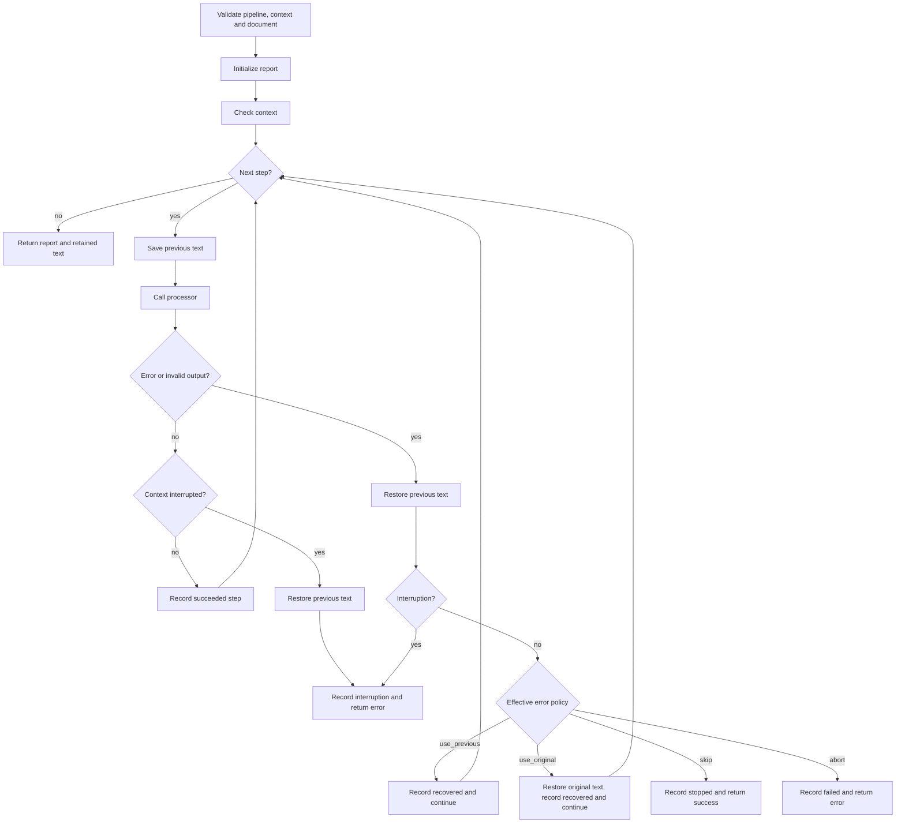

# Text-processing pipeline

> **Document status:** normative description of the current pre-release text-processing pipeline.
>
> **Audience:** users configuring module chains, operators interpreting pipeline results, module authors, maintainers, and reviewers.
>
> **Scope:** this document describes pipeline construction, ordered execution, rollback, error policies, cancellation, reporting, and logging integration. The broader application lifecycle is documented in [`architecture.md`](architecture.md). Exact JSON defaults and validation limits belong in [`configuration.md`](configuration.md).

---

## 1. Purpose

The pipeline is the text-transformation core of `fish-audio-cli`.

It accepts one valid input string, runs zero or more configured module instances in strict array order, and retains one valid output string for Fish Audio synthesis.

In its simplest form:

```text
original text
    │
    ▼
module instance 1
    │
    ▼
module instance 2
    │
    ▼
...
    │
    ▼
module instance N
    │
    ▼
processed text
```

The pipeline is intentionally limited to text-to-text processing.

It does not:

- call Fish Audio as part of ordinary pipeline execution;
- write audio files;
- load the Fish API key;
- parse the top-level JSON configuration file;
- decide command-line exit codes;
- run modules in parallel;
- construct an arbitrary workflow graph;
- allow a module to return an arbitrary data type.

Its responsibility is narrower:

> Execute configured text processors in order while preserving a valid recoverable text state and reporting what happened.

---

## 2. Relationship to the application

The CLI does not call the pipeline package directly with an unvalidated command-line string.

The normal application path is:

```text
CLI input
    ↓
input size and text validation
    ↓
app.ProcessText
    ↓
pipeline.NewDocument
    ↓
Pipeline.Process
    ↓
processed text and pipeline report
```

`internal/app` provides the application-facing string boundary.

The pipeline package works with a `Document` because execution needs both:

- the immutable original input;
- the mutable current text.

After pipeline processing finishes successfully, the application uses the retained current text to construct the Fish synthesis request.

---

## 3. Terminology

The following terms have specific meanings.

| Term | Meaning |
|---|---|
| **Module type** | A registered implementation, such as `passthrough` |
| **Module instance** | One configured item in `pipeline.modules` |
| **Preparer** | A function that validates one instance’s opaque JSON config and returns a builder |
| **Builder** | A function invoked after every instance prepares successfully; it creates one processor |
| **Processor** | Runtime object implementing the text transformation |
| **Step** | Processor plus configured instance name, module type, and effective error policy |
| **Pipeline** | Validated ordered collection of steps |
| **Document** | Original immutable text plus mutable current text |
| **Previous text** | Current text saved immediately before one step starts |
| **Original text** | Text supplied when the document was created |
| **Retained text** | Text left in the document after success, rollback, or recovery |
| **Recovery** | Continuing after a failed step through `use_previous` or `use_original` |
| **Interruption** | Cancellation or deadline expiration |
| **Report** | Structured metadata describing one pipeline execution |
| **Step result** | Structured metadata describing one started step |

A module instance, processor, and step are related but are not interchangeable:

```text
configured module instance
        ↓ prepare
instance-specific builder
        ↓ build
processor
        ↓ bind metadata and policy
step
```

---

## 4. Configured module order

`pipeline.modules` is an ordered JSON array.

Example:

```json
{
  "pipeline": {
    "onError": "use_previous",
    "modules": [
      {
        "name": "first-pass",
        "type": "passthrough",
        "config": {}
      },
      {
        "name": "second-pass",
        "type": "passthrough",
        "onError": "abort",
        "config": {}
      }
    ]
  }
}
```

Execution order is exactly:

```text
first-pass
second-pass
```

The core does not reorder modules by:

- type;
- name;
- error policy;
- dependency;
- estimated cost;
- whether a module changes the text.

The output retained after one successful instance becomes the input to the next instance.

The same module type may appear more than once under different instance names.

Each instance remains independent because it has its own:

- name;
- opaque config object;
- optional `onError` override;
- preparation result;
- builder;
- processor;
- step result.

There is no implicit config inheritance between instances.

---

## 5. Pipeline construction

Pipeline construction occurs before text input is read.

It has three layers:

```text
configured module definitions
        ↓
prepare every instance
        ↓
build every processor
        ↓
validate and create Pipeline
```

### 5.1 Effective error policy

The module registry resolves an effective policy for each instance.

Resolution is:

```text
module.onError, when present
otherwise pipeline.onError
```

The pipeline execution engine does not perform inheritance itself.

By the time a `Step` reaches `pipeline.New`, its `ErrorPolicy` is already concrete.

Supported values are:

```text
use_previous
use_original
skip
abort
```

Policy strings are exact. The parser does not invent aliases or silently normalize unknown values.

### 5.2 Prepare phase

Every configured instance is prepared in array order.

A preparer receives:

- the project path resolver;
- that instance’s raw JSON config object.

Preparation is responsible for:

- strict module-specific decoding;
- semantic validation;
- resolving module-owned paths when needed;
- producing immutable instance-specific values;
- returning one builder.

A preparation error identifies the configured instance and type.

If any instance fails preparation:

- preparation stops;
- no builder is invoked;
- no processor is created;
- no pipeline is created;
- text input is not read;
- the Fish API key is not loaded;
- Fish synthesis is not attempted.

This all-prepare-before-build rule prevents early processors from being created when a later module has invalid configuration.

### 5.3 Build phase

Builders run only after every configured module instance has prepared successfully.

Builders run in array order.

Each builder must return:

- one non-nil processor; or
- an initialization error.

If a builder fails:

- later builders do not run;
- pipeline construction fails;
- text input is not read;
- Fish synthesis is not attempted.

If a builder returns an ordinary nil or a typed nil processor, construction fails.

### 5.4 Processor lifecycle limitation

The current processor interface does not include `Close`.

The application does not have a processor shutdown phase.

A processor therefore must not own a resource whose correct use requires an explicit cleanup call.

This is an explicit current limitation, not permission to leak resources.

Suitable processor-owned state includes:

- immutable configuration;
- compiled regular expressions;
- in-memory dictionaries;
- reusable clients that require no explicit close;
- instance-local synchronization or caches.

A future mandatory-cleanup requirement must address the complete lifecycle:

- partial build failure;
- ownership transfer;
- reverse-order shutdown;
- repeated close calls;
- simultaneous processing and close;
- multiple close errors;
- process exit behavior.

An optional `Close` method added only to one module would not solve those system-level questions.

### 5.5 Step validation

`pipeline.New` validates every step before creating a pipeline.

For each step:

- `Name` must not be empty or whitespace-only;
- `Name` must not have leading or trailing whitespace;
- names must be unique;
- `Type` must not be empty or whitespace-only;
- `Type` must not have leading or trailing whitespace;
- `Processor` must not be nil, including typed nil;
- `ErrorPolicy` must be supported.

An empty step list is valid.

### 5.6 Private step order

`pipeline.New` copies the supplied step slice.

Changing the caller’s original slice after construction does not change:

- the number of pipeline steps;
- their order;
- the step values stored by the pipeline.

The processor objects referenced by those steps are not deep-copied.

Processor state remains owned by the processor implementation.

---

## 6. The pipeline document

The document contains two text values.

```go
type Document struct {
    originalText string
    Text         string
}
```

### 6.1 Original text

The original text is stored in an unexported field.

It is set when `NewDocument` succeeds.

It is exposed through:

```go
document.OriginalText()
```

Modules cannot directly assign a new original value.

`use_original` relies on this immutable snapshot.

### 6.2 Current text

`Document.Text` is the mutable value passed from step to step.

A processor may:

- leave it unchanged;
- replace it with transformed text;
- return an error.

The pipeline validates retained text before accepting a successful step.

### 6.3 Document creation

`NewDocument` validates the initial text.

On success:

```text
original text = input text
current text  = input text
```

The application creates one document per `ProcessText` call.

---

## 7. Text validity contract

Valid pipeline text must satisfy both conditions:

1. it is valid UTF-8;
2. it contains at least one non-whitespace Unicode code point.

Rejected examples include:

```text
empty string
spaces only
tabs and newlines only
invalid UTF-8 byte sequences
```

This contract applies at several boundaries:

- CLI input;
- document creation;
- pipeline entry;
- successful processor output;
- Fish request text.

The repeated checks protect separate package boundaries.

They are not merely duplicate lines waiting to be “optimized” away.

---

## 8. Processor contract

A processor implements:

```go
Process(
    ctx context.Context,
    document *pipeline.Document,
) error
```

A processor is expected to:

- treat `ctx` as the cancellation authority;
- read the current `document.Text`;
- compute a new valid string;
- assign the final value to `document.Text`;
- return `nil` only when its result is valid;
- return a contextual error when processing fails;
- avoid changing the document’s original text;
- avoid logging secrets;
- avoid panics for ordinary invalid or external conditions.

### 8.1 Preferred mutation pattern

When practical, compute the result before mutating the document:

```go
func (p *processor) Process(
    ctx context.Context,
    document *pipeline.Document,
) error {
    if err := ctx.Err(); err != nil {
        return err
    }

    result, err := transform(document.Text)
    if err != nil {
        return fmt.Errorf("transform text: %w", err)
    }

    document.Text = result
    return nil
}
```

This keeps module code locally understandable.

The pipeline rollback still exists as the system-level safety boundary.

### 8.2 Context cooperation

The pipeline checks context:

- before execution begins;
- before each step;
- after each processor returns;
- when a processor returns an error.

A processor must still cooperate with cancellation during long-running work.

The pipeline cannot forcibly interrupt a processor that:

- blocks indefinitely;
- ignores `ctx`;
- performs an external call without the supplied context.

Cancellation takes effect once control returns to the pipeline unless the processor itself observes it earlier.

### 8.3 Panic behavior

The pipeline does not recover processor panics.

A panic escapes the normal pipeline error-policy system and may terminate the process.

Processors must return errors for expected failure conditions.

Panic recovery should not be added casually at the pipeline boundary because doing so would require an explicit policy for:

- potentially corrupted processor state;
- partially mutated documents;
- stack reporting;
- continued use of the same process;
- whether programmer defects should be converted into fallback synthesis.

The current CLI is a single-run process, so an unexpected panic remains a programmer defect rather than an ordinary module result.

---

## 9. Execution algorithm

At a high level:



Equivalent pseudocode:

```text
validate receiver, context and document
validate current document text
create report

if context is already interrupted:
    return interrupted report and error

for each step in order:
    if context is interrupted:
        return interrupted report and error

    previousText = document.Text
    start timer

    stepError = processor.Process(ctx, document)

    if stepError is nil:
        validate document.Text
        convert invalid output into stepError

    stop timer

    if stepError exists:
        document.Text = previousText

        if stepError is cancellation or deadline:
            record interrupted step
            return interrupted report and error

        if ctx is interrupted:
            record interrupted step using context error
            return interrupted report and error

        apply effective error policy

    otherwise:
        if ctx is interrupted:
            document.Text = previousText
            record interrupted step
            return interrupted report and error

        record succeeded step

return report
```

---

## 10. Validation before report creation

`Pipeline.Process` first validates:

- the pipeline receiver;
- the context, including typed nil;
- the document pointer;
- the document’s current text.

If one of these checks fails, it returns:

- an empty `Report`;
- a contextual error.

After those checks pass, a report is initialized.

From that point onward, failures and interruptions return a meaningful partial report.

This distinction matters to callers:

```text
invalid call boundary
    → empty report

valid call that begins pipeline execution
    → complete or partial report
```

---

## 11. Per-step snapshot and rollback

Immediately before calling a processor, the pipeline saves:

```text
previousText = document.Text
```

Go strings are immutable values, so this assignment provides a stable snapshot of the previous string.

If the processor fails or produces invalid output:

```text
document.Text = previousText
```

Rollback happens before the error policy is applied.

The failed processor’s partial mutation is never retained.

### 11.1 What rollback covers

Rollback covers changes to:

```go
document.Text
```

It does not undo arbitrary side effects inside a processor, such as:

- external API calls;
- writes to unrelated files;
- database updates;
- mutations of processor-owned state;
- logs already emitted.

Module authors should avoid irreversible side effects in ordinary text processors.

Where external work is necessary, the module must document its own behavior and make failures safe.

---

## 12. Error policies

The effective policy determines what happens after ordinary processor failure or invalid output.

It does not override cancellation or deadline expiration.

### 12.1 Policy summary

| Policy | Retained text after failure | Continue to next step | Pipeline returns error | Fish synthesis may continue |
|---|---|---:|---:|---:|
| `use_previous` | Text from before failed step | Yes | No | Yes |
| `use_original` | Original pipeline input | Yes | No | Yes |
| `skip` | Text from before failed step | No | No | Yes |
| `abort` | Text from before failed step | No | Yes | No |

### 12.2 `use_previous`

Behavior:

```text
restore previous text
record step as recovered
continue with next step
```

Example:

```text
original:             "A"
after module one:     "AB"
module two partially writes "BROKEN" and fails
retained after policy:"AB"
module three input:   "AB"
```

This policy is suited to optional enhancement modules where failure should preserve all earlier successful transformations.

Pipeline outcome becomes `recovered` unless a later step changes the final outcome to:

- `stopped`;
- `failed`;
- `interrupted`.

### 12.3 `use_original`

Behavior:

```text
restore previous text
then replace it with original pipeline input
record step as recovered
continue with next step
```

Example:

```text
original:             "A"
after module one:     "AB"
module two fails
retained after policy:"A"
module three input:   "A"
```

This policy discards all earlier successful transformations, not merely the failed module’s mutation.

The original value remains the text from pipeline entry even after repeated recoveries.

### 12.4 `skip`

Behavior:

```text
restore previous text
record failed step as stopped
stop all remaining steps
return no pipeline error
```

Example:

```text
original:             "A"
after module one:     "AB"
module two fails
retained after policy:"AB"
module three:         not executed
pipeline return:      success with stopped report
```

`skip` means:

> Stop the remainder of the pipeline and synthesize the retained text.

It does not mean:

> Ignore only this failed module and continue.

Use `use_previous` for that behavior.

### 12.5 `abort`

Behavior:

```text
restore previous text
record failed step
stop all remaining steps
return an error
```

Example:

```text
original:             "A"
after module one:     "AB"
module two fails
retained after policy:"AB"
module three:         not executed
pipeline return:      error
Fish synthesis:       not started
```

The returned error wraps the processor error with module instance and type context.

### 12.6 Unsupported policy

A pipeline created through `pipeline.New` cannot normally reach execution with an unsupported policy because construction validates every step.

The execution switch still has a defensive unsupported-policy branch.

If internal invariants are bypassed or corrupted, processing fails rather than silently choosing a fallback.

---

## 13. Invalid successful output

A processor may return `nil` while leaving invalid text.

Examples:

```go
document.Text = ""
return nil
```

or:

```go
document.Text = "   \n\t"
return nil
```

The pipeline converts this into a step error:

```text
invalid text output
```

It then:

1. restores previous text;
2. checks for interruption;
3. applies the effective error policy.

Invalid output is therefore handled like an ordinary module failure.

A module cannot bypass the text contract merely by returning `nil`.

---

## 14. Cancellation and deadlines

Cancellation has higher priority than all fallback policies.

Recognized interruption errors are:

```go
context.Canceled
context.DeadlineExceeded
```

### 14.1 Interrupted before execution

If the context is already interrupted after report initialization:

- no step starts;
- report outcome becomes `interrupted`;
- `Steps` remains empty;
- a context-wrapping error is returned.

### 14.2 Interrupted before a later step

Before each step, context is checked again.

If interrupted:

- that step does not start;
- no `StepResult` is added for it;
- previously completed step results remain;
- report outcome becomes `interrupted`.

### 14.3 Processor returns an interruption error

If the processor returns an error matching cancellation or deadline expiration:

- current text is rolled back to previous text;
- the step is recorded as `interrupted`;
- the pipeline outcome becomes `interrupted`;
- configured fallback policy is ignored;
- remaining steps do not run;
- an error is returned.

### 14.4 Context interrupted while processor returns another error

A processor may return an ordinary error after the context became interrupted.

The pipeline checks `ctx.Err()` after rollback.

When the context is interrupted:

- the step is classified as interrupted;
- `StepResult.Err` records the context error;
- configured fallback policy is ignored;
- the returned pipeline error wraps the context error.

This prevents a concurrent cancellation from being misreported as ordinary recoverable failure.

### 14.5 Context interrupted after processor success

A processor may return `nil` just after cancellation occurs.

The pipeline checks context before accepting success.

If interrupted:

- current text is rolled back to previous text;
- the step is recorded as interrupted;
- the processor’s apparent success is not retained;
- remaining steps do not run.

### 14.6 Cancellation does not preempt blocking code

Context is cooperative.

If a processor blocks and never observes `ctx`, the pipeline cannot regain control to apply interruption handling.

Long-running modules must pass the supplied context to:

- HTTP requests;
- model calls;
- subprocesses that support cancellation;
- waits and retry timers.

---

## 15. Pipeline outcomes

A report uses one of five outcomes.

| Outcome | Meaning |
|---|---|
| `succeeded` | All executed steps succeeded and no recovery was needed |
| `recovered` | At least one step failed and recovered; processing reached the end |
| `stopped` | `skip` stopped remaining steps without a pipeline error |
| `failed` | Ordinary failure stopped processing and returned an error |
| `interrupted` | Cancellation or deadline stopped processing |

### 15.1 Outcome precedence during execution

The outcome begins as:

```text
succeeded
```

A recovery changes it to:

```text
recovered
```

A later terminal event replaces the prior nonterminal outcome:

```text
skip         → stopped
abort        → failed
cancellation → interrupted
deadline     → interrupted
```

Examples:

```text
recovery, then later success
    → recovered

recovery, then skip
    → stopped

recovery, then abort
    → failed

recovery, then cancellation
    → interrupted
```

---

## 16. Execution report

A `Report` summarizes the complete or partial run.

Conceptually:

```go
type Report struct {
    Outcome     Outcome
    TotalSteps  int
    InputChars  int
    OutputChars int
    Duration    time.Duration
    Steps       []StepResult
}
```

### 16.1 `Outcome`

Final pipeline state.

See [Pipeline outcomes](#15-pipeline-outcomes).

### 16.2 `TotalSteps`

Number of configured steps in the pipeline.

This includes steps that never started because processing:

- stopped;
- failed;
- was interrupted.

### 16.3 `InputChars`

Number of Unicode code points in the text at pipeline entry.

This is not:

- byte count;
- grapheme-cluster count;
- displayed glyph count;
- token count.

### 16.4 `OutputChars`

Number of Unicode code points retained when processing finished.

It reflects:

- final transformed text;
- previous text after rollback;
- original text after `use_original`;
- retained text after `skip`;
- retained text after failure or interruption.

A deferred update ensures it reflects the document’s final retained state.

### 16.5 `Duration`

Wall-clock time from report initialization until pipeline return.

It includes:

- initial context check after report creation;
- processor calls;
- processor decorators;
- output validation;
- rollback and policy handling.

It does not include:

- CLI input reading;
- module construction;
- Fish synthesis;
- output-file publication.

### 16.6 `Steps`

Results for steps that started execution.

Order matches execution order.

A configured step absent from `Steps` did not start.

---

## 17. Step results

A `StepResult` contains:

```go
type StepResult struct {
    Name        string
    Type        string
    ErrorPolicy ErrorPolicy
    Outcome     Outcome
    InputChars  int
    OutputChars int
    Duration    time.Duration
    Err         error
}
```

### 17.1 Identity

`Name` is the configured instance name.

`Type` is the registered implementation type.

Two steps may share `Type` but must not share `Name`.

### 17.2 Effective policy

`ErrorPolicy` records the concrete effective policy used for the step.

It does not indicate whether the value originated from:

- `pipeline.onError`; or
- the instance’s `onError` override.

That inheritance decision has already been resolved during construction.

### 17.3 Step outcome

A started step may finish as:

| Step outcome | Meaning |
|---|---|
| `succeeded` | Processor returned valid text and context remained active |
| `recovered` | Processor failed or produced invalid text; fallback continued |
| `stopped` | Processor failed and `skip` stopped the remainder |
| `failed` | Processor failed and `abort` returned an error |
| `interrupted` | Cancellation or deadline stopped processing |

### 17.4 Character counts

`InputChars` counts the current text immediately before the processor call.

`OutputChars` counts text retained after:

- success;
- rollback;
- `use_original` recovery;
- stopping;
- interruption.

It does not necessarily count text momentarily produced by a failed processor.

### 17.5 Duration

Step duration measures the processor call.

When the processor is decorated with module logging, decorator work is included.

Time spent applying rollback and error policy after the call is not part of the processor duration.

### 17.6 Error

`Err` is:

- nil for success;
- the processor or invalid-output error for recovery, stopping, or ordinary failure;
- the interruption error for an interrupted step.

A recovered step intentionally retains its error in the report.

Recovery means the pipeline continued, not that the underlying problem vanished.

---

## 18. Application result behavior

`app.ProcessText` returns:

```go
type ProcessTextResult struct {
    Text   string
    Report pipeline.Report
}
```

### 18.1 Successful pipeline return

When pipeline execution returns no error:

- `Text` contains retained document text;
- `Report` contains the complete execution report.

This includes:

- `succeeded`;
- `recovered`;
- `stopped`.

A `stopped` report is still a successful application text-processing result.

### 18.2 Failed or interrupted pipeline return

When pipeline execution returns an error:

- `Report` contains the partial report;
- `Text` is not populated in the returned result.

The report still exposes retained character counts and completed step metadata.

Fish request construction does not proceed.

---

## 19. Logging decorator

The CLI wraps each processor with `pipeline.WithLogging` before creating the application pipeline.

The decorator preserves:

- step name;
- module type;
- effective error policy.

It replaces only the processor field with a logging wrapper.

### 19.1 Start log

Before calling the underlying processor, it logs:

- message: `module processing started`;
- `module_name`;
- `module_type`;
- `input_chars`.

### 19.2 Success log

After valid output and an active context, it logs:

- message: `module processing completed`;
- `module_name`;
- `module_type`;
- `input_chars`;
- `output_chars`;
- `duration_ms`.

### 19.3 Failure log

For ordinary failure or invalid output, it logs:

- message: `module processing failed`;
- module identity;
- input size;
- duration;
- error.

### 19.4 Interruption log

For cancellation or deadline, it logs a warning:

- message: `module processing interrupted`;
- module identity;
- input size;
- duration;
- interruption error.

### 19.5 Why output is validated twice

The logging decorator validates text before logging successful completion.

The pipeline validates again after the decorated processor returns.

This is deliberate:

- the decorator must not emit a false success log;
- the pipeline must remain correct when used without the decorator;
- the pipeline does not assume every processor is wrapped.

### 19.6 What the decorator does not do

The decorator does not:

- apply error policies;
- roll back text;
- select `use_previous`, `use_original`, `skip`, or `abort`;
- decide the final pipeline outcome;
- log full text;
- convert ordinary failure into success.

Fallback and rollback remain pipeline responsibilities.

---

## 20. Empty pipeline

An empty module array is valid.

Example:

```json
{
  "pipeline": {
    "onError": "use_previous",
    "modules": []
  }
}
```

For valid input and an active context:

- no processor runs;
- output text equals original input;
- report outcome is `succeeded`;
- `TotalSteps` is `0`;
- `Steps` is empty;
- input and output character counts are equal.

An empty pipeline is useful when:

- local text transformation is not required;
- testing the Fish synthesis path independently;
- temporarily disabling all modules without changing core behavior.

The pipeline still validates input text and context.

---

## 21. Worked policy example

Consider this conceptual pipeline:

```text
original text: "one"

step A:
    succeeds
    output: "one two"

step B:
    writes "broken"
    returns an error

step C:
    would append " three"
```

### 21.1 Step B uses `use_previous`

Result:

```text
step A outcome: succeeded
step B outcome: recovered
step C input:   "one two"
final text:     "one two three"
report outcome: recovered
pipeline error: none
```

### 21.2 Step B uses `use_original`

Result:

```text
step A outcome: succeeded
step B outcome: recovered
step C input:   "one"
final text:     "one three"
report outcome: recovered
pipeline error: none
```

### 21.3 Step B uses `skip`

Result:

```text
step A outcome: succeeded
step B outcome: stopped
step C:         not started
final text:     "one two"
report outcome: stopped
pipeline error: none
```

### 21.4 Step B uses `abort`

Result:

```text
step A outcome: succeeded
step B outcome: failed
step C:         not started
retained text:  "one two"
report outcome: failed
pipeline error: returned
Fish synthesis: not started
```

---

## 22. Invalid output example

Conceptual processor:

```go
func (p *processor) Process(
    ctx context.Context,
    document *pipeline.Document,
) error {
    document.Text = "   "
    return nil
}
```

Even though the processor returns `nil`, the pipeline sees whitespace-only output as invalid.

For `use_previous`:

```text
restore previous valid text
record step as recovered
continue
```

For `use_original`:

```text
restore original input
record step as recovered
continue
```

For `skip`:

```text
restore previous valid text
record step as stopped
return no pipeline error
```

For `abort`:

```text
restore previous valid text
record step as failed
return pipeline error
```

---

## 23. Interruption example

Conceptual processor:

```go
func (p *processor) Process(
    ctx context.Context,
    document *pipeline.Document,
) error {
    select {
    case <-ctx.Done():
        return ctx.Err()
    case result := <-p.result:
        document.Text = result
        return nil
    }
}
```

When the invocation receives `SIGINT` or `SIGTERM`:

```text
signal-aware CLI context is canceled
processor observes ctx.Done()
processor returns context.Canceled
pipeline restores previous text
step outcome becomes interrupted
pipeline outcome becomes interrupted
remaining steps do not run
Fish synthesis does not start
CLI returns the text-processing failure stage
```

The configured module error policy does not convert this interruption into recovered success.

---

## 24. Error wrapping

Pipeline errors add instance context.

Ordinary abort example:

```text
module "normalize-primary" of type "normalizer" failed: <processor error>
```

Interruption example:

```text
module "emotion-pass" of type "llm-emotion" interrupted: <context error>
```

The underlying error is wrapped with `%w`.

Callers may use:

```go
errors.Is(err, target)
errors.As(err, &target)
```

when the underlying processor or context error supports those operations.

Error text is for humans.

Error identity is for programmatic classification.

---

## 25. Concurrency and reuse

The CLI creates one application and performs one pipeline execution per process invocation.

The pipeline package does not promise that one `Pipeline` instance is safe for concurrent `Process` calls.

Although the step slice is private after construction, processors may contain mutable instance state.

Concurrent use is safe only when every processor and decorator involved explicitly supports it.

Module authors must not assume that package-level mutable state is acceptable merely because the CLI currently runs one document per process.

Independent CLI processes do not share processor instances.

---

## 26. Module side effects

The rollback model protects only current text.

It does not provide transactionality for external side effects.

A text module should normally avoid:

- writing final user files;
- mutating global state;
- changing unrelated configuration;
- committing database changes;
- sending irreversible messages;
- publishing external results.

A module that calls an external text service may be reasonable, but it must:

- use the supplied context;
- keep configuration instance-local;
- return errors rather than selecting fallback itself;
- avoid logging secrets;
- document whether the external service receives input text;
- avoid mandatory-close resources under the current lifecycle.

The core applies pipeline fallback after the module returns.

A module must not secretly implement a second conflicting fallback policy unless that behavior is an explicit part of the module’s own algorithm.

---

## 27. User and operator guidance

### 27.1 Choose `use_previous` when

- the module is an optional enhancement;
- earlier transformations should be preserved;
- later modules may still provide value.

### 27.2 Choose `use_original` when

- any failure should discard the entire transformed chain so far;
- later modules are meaningful against raw original input;
- mixing partially transformed text with later processing would be unsafe.

### 27.3 Choose `skip` when

- a failure makes all later modules inappropriate;
- retained text is still safe to synthesize;
- the failure should not prevent audio generation.

### 27.4 Choose `abort` when

- transformed output is mandatory;
- synthesis of fallback text would be misleading or unsafe;
- module failure must be visible to the caller as an error.

### 27.5 Read the report, not only the error

No returned error does not always mean every module succeeded.

Possible successful pipeline outcomes are:

```text
succeeded
recovered
stopped
```

Operators should inspect structured logs or the report when recovery matters operationally.

---

## 28. Common misconceptions

### “`skip` skips the failed module”

Incorrect.

`skip` stops the remaining pipeline after restoring previous text.

Use `use_previous` to continue after one failed module.

### “A module can return empty text to suppress synthesis”

Incorrect.

Empty or whitespace-only output violates the shared text contract and is treated as module failure.

There is currently no pipeline outcome meaning “produce no audio successfully.”

### “`use_original` retries the failed module with original text”

Incorrect.

It restores original text and continues with the next module.

The failed module is not invoked again.

### “A recovered step has no error”

Incorrect.

Its `StepResult.Err` retains the cause of recovery.

### “A processor can ignore context because the pipeline checks it”

Incorrect.

The pipeline checks context around the processor call but cannot preempt blocking module code.

### “The pipeline rolls back all side effects”

Incorrect.

It rolls back `Document.Text`, not external actions or arbitrary processor state.

### “No pipeline error means all configured steps executed”

Incorrect.

`skip` returns no error while leaving later steps unexecuted.

Check `Report.Outcome` and `len(Report.Steps)`.

### “The pipeline automatically closes processors”

Incorrect.

No processor cleanup lifecycle currently exists.

---

## 29. Test expectations

Pipeline behavior should remain covered by tests for at least:

### Construction

- empty pipeline;
- copied step slice;
- blank names;
- names with surrounding whitespace;
- duplicate names;
- blank types;
- types with surrounding whitespace;
- ordinary nil processor;
- typed nil processor;
- unsupported policy.

### Successful execution

- one step;
- multiple ordered steps;
- unchanged text;
- Unicode character counts;
- empty pipeline.

### Failure policies

- `use_previous`;
- `use_original`;
- `skip`;
- `abort`;
- recovery followed by later success;
- recovery followed by terminal failure.

### Invalid output

- empty output;
- whitespace-only output;
- invalid UTF-8 output;
- rollback before policy.

### Interruption

- already canceled before first step;
- canceled before a later step;
- processor returns `context.Canceled`;
- processor returns `context.DeadlineExceeded`;
- context canceled while processor returns another error;
- context canceled after apparent processor success;
- rollback on interruption.

### Reporting

- total configured steps;
- only started steps included;
- retained output count;
- recovered error preserved;
- partial report on failure;
- partial report on interruption;
- empty report for invalid call arguments.

### Logging wrapper

- start and completion logs;
- ordinary failure log;
- interruption warning;
- invalid-output failure log;
- nil logger rejection;
- ordinary and typed nil processor rejection;
- step metadata preserved.

Behavior changes require corresponding tests and documentation updates.

---

## 30. Pipeline invariants

The following are normative invariants.

1. Steps run strictly in stored order.
2. Step names are unique.
3. Step names and types contain no surrounding whitespace.
4. Every step has one non-nil processor.
5. Every step has one supported effective error policy.
6. Pipeline input is valid text.
7. A processor receives the current retained text.
8. A successful processor leaves valid text.
9. Previous text is saved before every processor call.
10. Failed or invalid output is rolled back before policy handling.
11. `use_previous` continues from previous text.
12. `use_original` continues from original text.
13. `skip` stops later steps without a pipeline error.
14. `abort` stops later steps with a pipeline error.
15. Interruption overrides fallback policies.
16. Interrupted step mutation is rolled back.
17. A step result exists only for a step that started.
18. A recovered step preserves its cause in `StepResult.Err`.
19. Report character counts describe retained text, not discarded partial output.
20. An empty pipeline returns valid input unchanged.
21. Pipeline rollback covers text only.
22. Processor panics are not converted into pipeline errors.
23. One pipeline instance has no blanket concurrent-use guarantee.
24. Processors have no explicit cleanup lifecycle.

A change that violates one of these rules is an architectural pipeline change.

It must be reviewed and documented as such.

---

## 31. Review checklist

When reviewing pipeline or module changes, verify:

### Construction

- Does every instance keep its own config and builder?
- Do all instances still prepare before any build?
- Are typed nil values rejected?
- Is configured order preserved?
- Is effective policy resolved once and recorded in the step?

### Processor behavior

- Does the module use the supplied context?
- Does it return errors instead of panicking?
- Does it avoid irreversible side effects?
- Does it produce valid UTF-8 nonblank text?
- Can two configured instances remain independent?
- Does it avoid mandatory-close resources?

### Failure behavior

- Is partial text mutation rolled back?
- Is interruption distinguished from ordinary failure?
- Does `skip` still stop the remainder?
- Does `use_original` restore pipeline-entry text?
- Does `abort` preserve the underlying error?

### Reporting

- Are only started steps recorded?
- Are character counts based on retained text?
- Is the recovery error preserved?
- Does final outcome reflect the terminal event?
- Do errors before execution still return an empty report?

### Documentation

- Are policy examples still accurate?
- Are outcome names unchanged?
- Are logs described according to actual fields?
- Are new side effects or lifecycle requirements disclosed?

---

## 32. Summary

The `fish-audio-cli` pipeline is an ordered, recoverable text-processing chain.

Its core guarantees are:

- exact configured order;
- independent module instances;
- validation before execution;
- previous-text snapshots;
- rollback on failure, invalid output, or interruption;
- four explicit error policies;
- cancellation precedence;
- structured partial reports;
- valid retained text for Fish synthesis.

The pipeline is deliberately not a general workflow framework.

Its narrow contract makes module behavior reviewable:

```text
valid text in
    ↓
one processor
    ↓
valid text or error out
```

The core then decides, consistently and visibly, whether to continue, reset, stop, abort, or report interruption.
